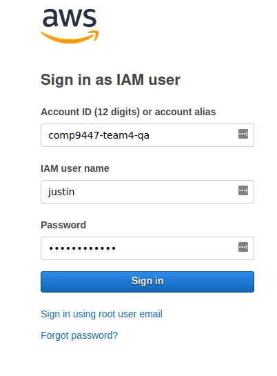
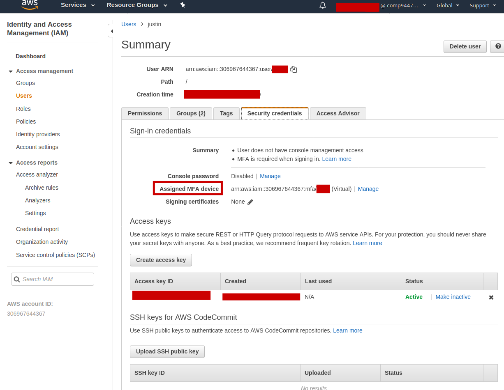

# COMP9447 Team 4 - 2020T3 - SOAR

The main repo for the SOAR project (COMP9447 Team4)

```
Team 4 (Drupal)
Mentor: Paul Hawkins
Tutor: Chong Yew Chang

Members:
Nathan Driscoll
Justin Ty
Sarah Ailin Liu
Yunsar Jilliani
Keung Lee
Elton Wong
Evangeline Endacott
William Yin
Dallas Yan
```

# Setup

These are written in `bash` which glues together AWS commands. This works best under Linux / MacOS.

If you are on Windows, Cygwin / WSL may work but it may not be as smooth.

* https://docs.microsoft.com/en-us/windows/wsl/install-win10
* https://www.cygwin.com/


# Setup prerequisites

This varies by OS but these instructions are for a Debian / Ubuntu based system.
You can also use `brew` for MacOS or Chocolatey for `Windows`.

## Jq
json parsing for API calls

```
sudo apt install direnv jq
```

## Direnv
Setup direnv for environment variables. This is used for substituing environment variables to params.
It's optional, you can just set your environment variables as in `.envrc-demo`.
```
cp .envrc-demo .envrc
direnv allow

echo 'eval "$(direnv hook zsh)"' >> ~/.zshrc
```

## AWS IAM User

Your username has been provisioned for you but you would still need to generate your own ACCESS KEYS and console passwords.

Steps:
* Go to AWS Console https://comp9447-team4-qa.signin.aws.amazon.com/console (I'll provide a password via Discord)



* On your first login, it will ask for you to generate a new password on login and keep it safe
* Go to AWS IAM -> Users -> Find your user -> Security Credentials
* Generate Access Keys and save it in your `~/.aws/credentials`. (See screenshot)
* Download Google Authenticator on your phone.
* Enabled MFA, save it on  your Google authenticator and copy the ARN to `~/.aws/credentials` as `mfa_serial`. (See screenshot below)



Note you will **not** be able to call commands if you do not have MFA enabled. This is part of a well architected framework.

## Test if your setup works

Test if you can call this command, if it works, you should see some json output:

```
AWS_PROFILE=qa aws sts get-caller-identity
{
    UserId: "...",
    Account: "..."
    Arn: "..."
}
```

## AWS CLI

Copy this template to your `~/.aws/cli`

```
[qa-user]
aws_access_key_id = <SECRET>
aws_secret_access_key = <SECRET>

[qa]
source_profile = qa-user
region = ap-southeast-2
role_arn = arn:aws:iam::306967644367:role/qa-project-member
mfa_serial = arn:aws:iam::306967644367:mfa/<YOUR_USERNAME>
```

# infra/ 

These contain infrastructure-as-code for comp9447-team4.

## infra/users/ folder

`infra/users/` contains the setup for AWS users that follows the well architected labs.

**THIS WILL ONLY BE NEEDED TO BE DONE ONCE** (Already provisioned for you).


# Branching (TODO)

* Checkout new branches from `dev` and submit new PRs onto `dev`.
* When we are satisfied with the `dev` branch, submit a PR to `master`
* Checkout a release branch off `master` (todo)
