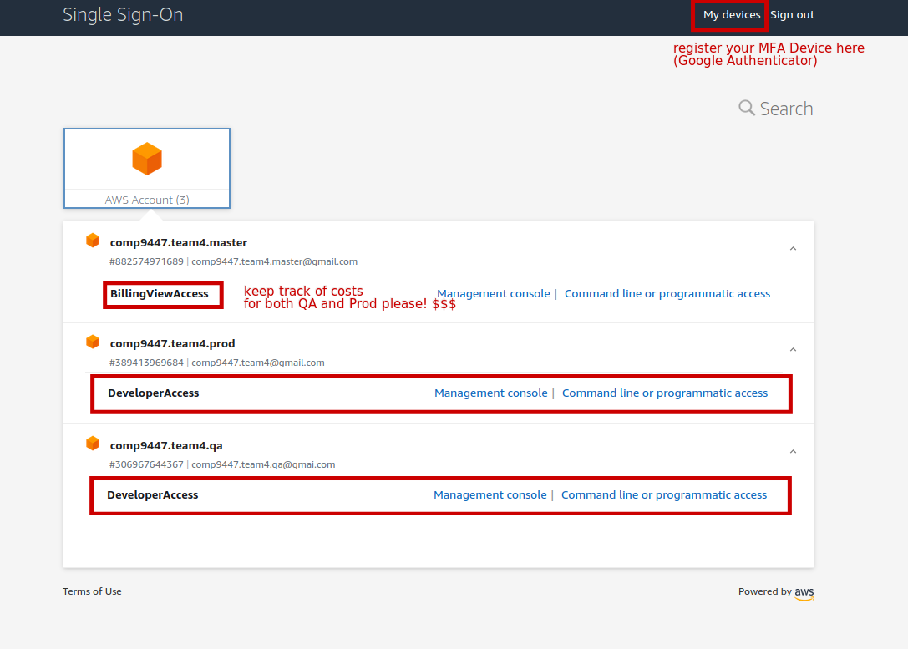
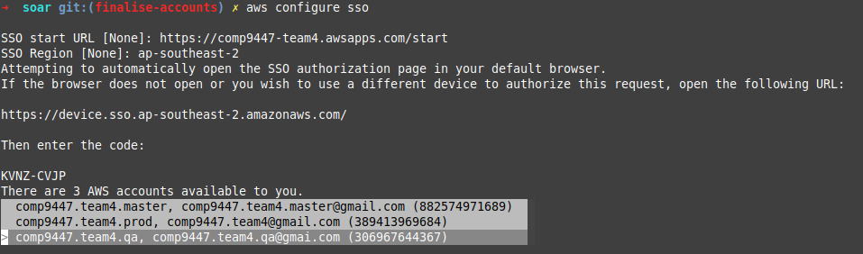
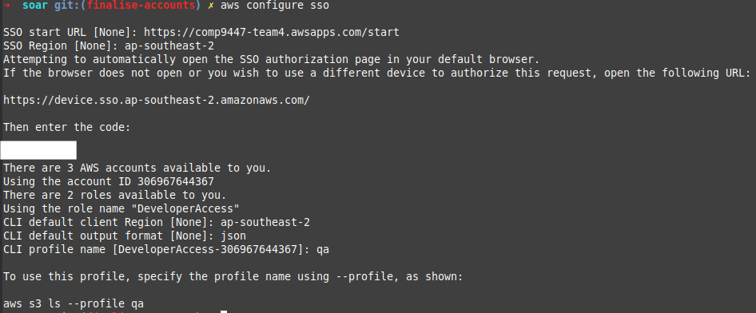

# COMP9447 Team 4 - 2020T3 - SOAR

The main repo for the SOAR project (COMP9447 Team4)

```
Team 4 (Drupal)
Mentor: Paul Hawkins
Tutor: Chong Yew Chang

Members:
Nathan Driscoll
Justin Ty
Sarah Ailin Liu
Yunsar Jilliani
Keung Lee
Elton Wong
Evangeline Endacott
William Yin
Dallas Yan
```

# User Setup

## AWS SSO

I'll send an email via AWS SSO. Follow the email instructions and add an MFA device.

Our portal can be found in:
https://comp9447-team4.awsapps.com/start

You would need an MFA device to login. Register with Google Authenticator on your phone and scan the QR code.

If you've set it up properly, you would be able to login to the console and see this:



Use the `developer` role for normal use and `billing` to keep track of $.

## AWS CLI

Install AWS CLI 2. Version 2 is required for AWS SSO.

https://docs.aws.amazon.com/cli/latest/userguide/install-cliv2.html

## AWS SSO CLI setup

To use the CLI with SSO, see:
https://docs.aws.amazon.com/cli/latest/userguide/cli-configure-sso.html


Once logged in via SSO, configure your AWS CLI in a terminal:

```sh
aws configure sso
SSO Start URL: https://comp9447-team4.awsapps.com/start
SSO Region: ap-southeast-2

<This will take you to a browser to login via SSO>
<Once logged in, it will then ask you to select qa or prod. Select qa to start with>

CLI default client Region: ap-southeast-2
CLI default output format: json
CLI profile name [CLI profile name [DeveloperAccess-306967644367]]: qa --> THIS IS IMPORTANT! Otherwise you might have to type in a very long profile name...
```



To test this, run this command in `qa`:

```
aws s3 ls --profile qa
```

## Having issues with SSO?

Remove the cache and retry.

```
mv ~/.aws/sso ~/.aws/sso.bak
mv ~/.aws/config ~/.aws/config.bak
rm -rf ~/.aws/cli/cache
rm -rf ~/.aws/sso/cache

aws configure sso
# Repeat steps above

# Clean up if successful
rm -rf ~/.aws/sso.bak
rm -f ~/.aws/config.bak
```

# Repo prerequisites

These are written in `bash` which glues together AWS commands. This works best under Linux / MacOS.

This varies by OS but these instructions are for a Debian / Ubuntu based system.
You can also use `brew` for MacOS or Chocolatey for `Windows`.

## Jq
json parsing for API calls

```
sudo apt install direnv jq
```

## Direnv
Setup direnv for environment variables. This is used for substituing environment variables to params.
It's optional, you can just set your environment variables as in `.envrc-demo`.
```
cp .envrc-demo .envrc
direnv allow

echo 'eval "$(direnv hook zsh)"' >> ~/.zshrc

# DO NOT COMMIT YOUR .envrc
```


# infra/ 

These contain infrastructure-as-code for comp9447-team4.

## infra/sso/ folder

This folder contains the setup for AWS users that follows the well architected labs. This uses AWS SSO.

**THIS WILL ONLY BE NEEDED TO BE DONE ONCE** on the master root account. (Already provisioned for you).

# Drupal

This will only need to be done **once**. Do not destroy the existing stack.

https://aws.amazon.com/quickstart/architecture/drupal/

Create a key pair with:

```
AWS_PROFILE=qa ./bin/key-pair.sh create
AWS_PROFILE=qa ./bin/key-pair.sh describe
```

Make sure you save it.


Deploy the stack with:

```
AWS_PROFILE=qa ./bin/drupal-stack.sh create
```

## Clean up Drupal stack
DO NOT DESTROY AN EXISTING STACK! (Maybe we should have termination protection on...)

```
AWS_PROFILE=qa ./bin/key-pair.sh delete
AWS_PROFILE=qa ./bin/drupal-stack.sh delete
```

