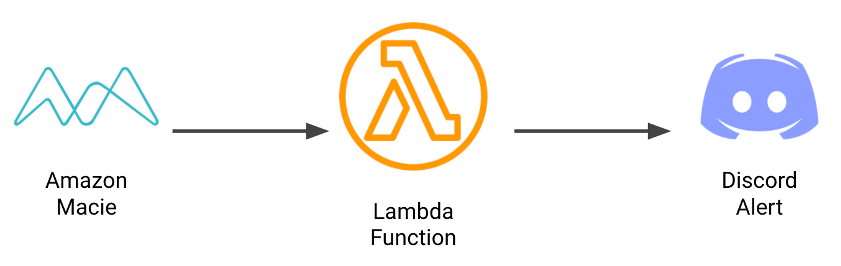

# macie-poller

Amazon Macie is a fully managed data security and privacy service that uses machine learning and pattern matching to discover and protect your sensitive data in AWS.



The macie-poller works by reaching out to the Macie findings and passing the ids to generate a message to be sent to Discord that response engineers can investigate and remediate. Due to the limitations of the CloudFormation documentation the Macie findings need to generated manually using the instructions below. 

Note: make sure that you have Python3 installed.

## Configure the Service

Install the requirements.txt
```
cd soar/services/macie-poller/macie-poller
pip3 -r install requirements.txt
```

Sign in to the console. If you have done these steps before you can skip them.
```
aws configure sso
SSO Start URL: https://comp9447-team4.awsapps.com/start
SSO Region: ap-southeast-2

<This will take you to a browser to login via SSO>
<Once logged in, it will then ask you to select qa or prod. Select qa to start with>

CLI default client Region: us-east-1 
  --> THIS IS IMPORTANT! All our development work must be in us-east-1 to get the latest resource features
CLI default output format: json
CLI profile name [CLI profile name [DeveloperAccess-306967644367]]: qa
  --> THIS IS IMPORTANT! Otherwise you might have to type in a very long profile name...
  
# Export the profile so that it is easier to sign in later
export AWS_PROFILEe=qa
```

If you have previously signed in follow these steps to sign in to the console. The profile must have been exported when you configured it.
```
aws sso login
```

Due to the limitations of the documentation, generating Macie findings will need to be completed manually from the Console.


## Run Locally
The service can be run locally using the following commands:
```
sam build
sam local invoke
```

## Deploying to the QA
Deploying to the QA environment can achieved using the following command:
```
Make deploy-qa
```

The Makefile runs the following commands:
```
build:
	sam build

deploy-qa: build
	AWS_PROFILE=qa sam deploy --config-env qa --parameter-overrides "ParameterKey=AwsEnvironment,ParameterValue=qa"

invoke: build
	sam local invoke -e events/sns.json
```

## Testing 

## Cleanup

To delete the sample application that you created, use the AWS CLI. Assuming you used your project name for the stack name, you can run the following:

```bash
aws cloudformation delete-stack --stack-name macie-poller
```
